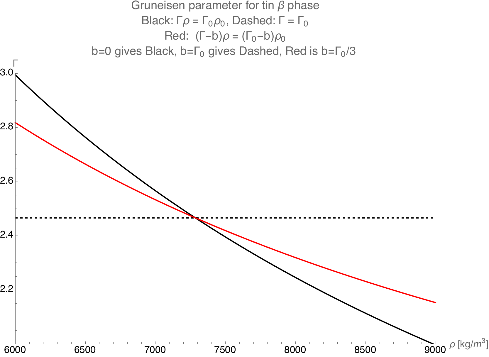
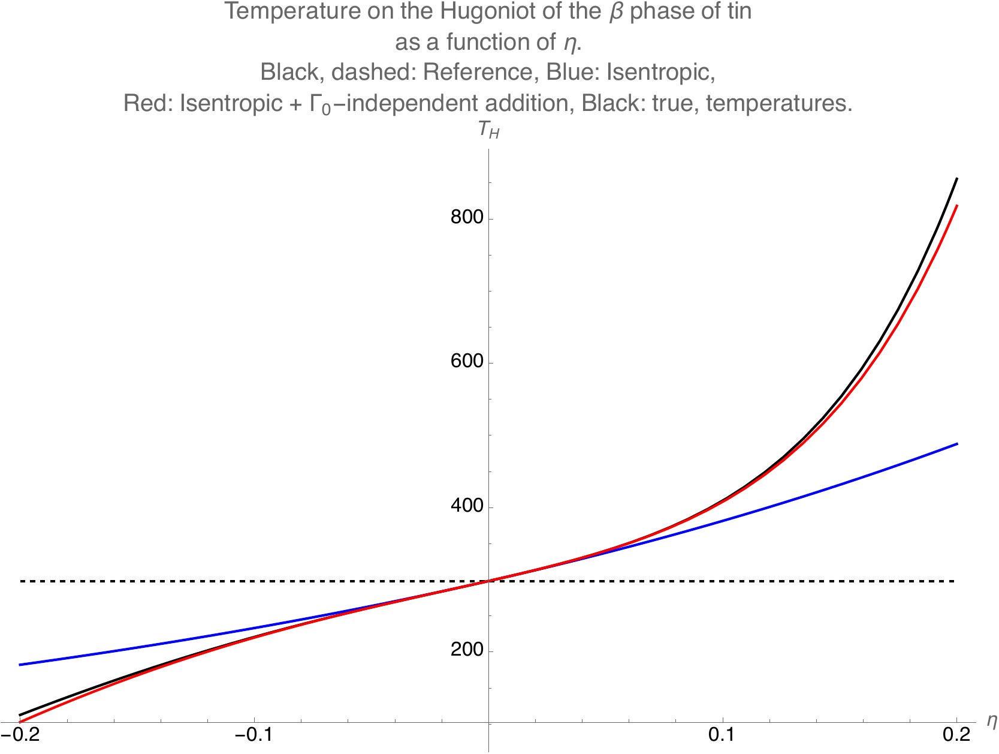
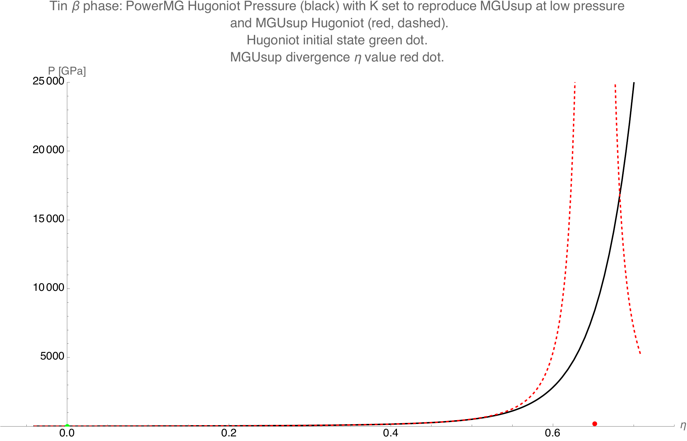

.. _models:

..
    Important references:

.. _MenikoffAndPlohr: https://doi.org/10.1103/RevModPhys.61.75

.. _MaxwellWiki: https://en.wikipedia.org/wiki/Maxwell_relations

.. _MenikoffCompleteEOS: https://www.osti.gov/biblio/1241653

.. _DavisReactants: https://doi.org/10.1016/S0010-2180(99)00112-1

.. _ProbingOffHugoniotStates: https://doi.org/10.1063/1.4939675

.. _WillsThermo: https://www.osti.gov/biblio/1561015

.. _NobleAbel: https://doi.org/10.1063/5.0079187

.. _StiffGas: https://doi.org/10.1016/j.ijthermalsci.2003.09.002

.. _PowerMG: https://www.osti.gov/biblio/1762624


EOS Models
===========

The mathematical descriptions of these models are presented below while the
details of using them is presented in the description of the 
:doc:`EOS API <using-eos>`.

EOS Theory
----------

An equation of state (EOS) is a constituitive model that generally relates
thermodynamic quantities such as pressure, temperature, density, internal
energy, free energy, and entropy consistent with the constraints of equillibrium
thermodynamics.

``singularity-eos`` contains a number of equations of state that are most useful
in hydrodynamics codes. All of the equations of state presented here are
considered "complete" equations of state in the sense that they contain all the
information needed to derive a given thermodynamic quantity. However, not all
variables are exposed since the emphasis is on only those that are needed for
hydrodynamics codes. An incomplete equation of state is often sufficient for
pure hydrodynamics since it can relate pressure to a given energy-density state,
but it is missing thermal information (see the section on :ref:`complete
equations of state <Complete EOS>`).

An excellent resource on equations of state in the context of hydrodynamics is
the seminal work from `Menikoff and Plohr <MenikoffAndPlohr_>`_. In particular,
Appendix A contains a number of thermodynamic relationships that can be useful
for computing additional quantities from those output in ``singularity-eos``.

The Mie-Gruneisen form
````````````````````````

Many of the following equations of state are considered to be of
the "Mie-Gruneisen form", which has many implications but for our purposes
means that the general form of the EOS is

.. math::

    P - P_\mathrm{ref} = \rho \Gamma(\rho) (e - e_\mathrm{ref})

where 'ref' denotes quantities along some reference curve, :math:`P` is the
pressure, :math:`\rho` is the density, :math:`\Gamma` is the Gruneisen
parameter, and :math:`e` is the specific internal energy. In this sense, an EOS
of this form uses the Gruneisen parameter to describe the pressure behavior of
the EOS away from the reference curve. Coupled with a relationship between
energy and temperature (sometimes as simple as a constant heat capacity), the
complete equation of state can be constructed.

To some degree it is the complexity of the reference state and the heat
capacity that will determine an EOS's ability to capture the complex behavior of
a material. At the simplest level, the ideal gas EOS uses a reference state at
zero pressure and energy, while more complex equations of state such as the
Davis EOS use the material's isentrope. In ths way, the reference curve
indicates the conditions under which you can expect the EOS to represent the
intended behavior.

Some Notes on Thermodynamic Consistency
````````````````````````````````````````

.. _Complete EOS:

For the pure purpose of solving the Euler equations, an incomplete equation of
state of the form :math:`P(\rho, e)` is sufficient. In essence, this provides the
mechanical response of a material subjected to different types of compression
and expansion. However, this EOS is lacking *thermal* information without an
appropriate heat capacity relationship.

As discussed `by Mattsson <WillsThermo_>`_, an equation of state can be
considered "complete" if it is constructed from one of the thermodynamic
potentials using their *natural variables*, i.e.

.. math::

    e =& e(\rho, S) \\
    h =& h(P, S) \\
    F =& F(\rho, T) \\
    G =& G(P, T) \\

where all potentials are specific. Here :math:`e` is again the internal energy,
:math:`h` is the enthalpy, :math:`F` is the Helmholtz free energy, and :math:`G`
is the Gibbs free energy. While equations of state formulated using the
Helmholtz free energy can be particularly attractive (such as the sesame
tables), finding a convenient form can be difficult. As such, it becomes
imperitive to extend the Mie-Gruneisen form so that it can form a complete
EOS.

The heat capacity is defined as

.. math::

    C_V := \left(\frac{\partial e}{\partial T}\right)_V
         = T \left(\frac{\partial S}{\partial T}\right)_V

which provides a natural means by which to relate the entropy/energy to the
temperature and form a complete equation of state. However, there are
specific requirements placed on the functional form of the heat capacity
described below.


The `Maxwell relations <MaxwellWiki_>`_ are the consequence of the
requirement that mixed partial second derivatives of the thermodynamic
potentials should be independent of the order of differentiation. This concept
can be extended to third derivatives (as Davis does in his Appendix B `here
<DavisReactants_>`_) to produce the relationship,

.. math::

    \frac{V}{C_V^2}\left(\frac{\partial C_V}{\partial V}\right)_S = 
      \left(\frac{\partial \Gamma}{\partial S}\right)_V.

This is often referred to as a "compatibility condition" (see also
`Menikoff <MenikoffCompleteEOS_>`_) and provides an important connection
between the Gruneisen parameter, :math:`\Gamma`, and the constant volume heat
capacity, :math:`C_V`, in the context of a complete equation of state
developed from the internal energy. Importantly, if the Gruneisen form forces
us to assume that the Gruneisen parameter is a sole function of
density/volume, then the implication is that the heat capacity ***must*** then
be a sole function of entropy.

Again from `Menikoff <MenikoffCompleteEOS_>`_, it can be shown that even
in the simplest possible case of a constant heat capacity, the temperature
is related to the energy through

.. math::

    T(\rho, e) = T_0 \phi(\rho) + \frac{e - e_{S,0}(\rho)}{C_V}

where :math:`T_0` represents a reference temperature, :math:`e_{S,0}` is the
energy along the isentrope that passes through the reference temperature, and
:math:`\phi(\rho)` is an integrating factor given by

.. math::

    \phi(\rho) = \exp\left(\int\limits_{\rho_0}^{\rho} \rho \Gamma
     (\rho) \mathrm{d}\rho \right).

As an EOS of a Mie-Gruneisen form becomes more complicated with more complex
functional forms for :math:`\Gamma` and the reference curves, the task of
calculating a **thermodynamically consistent** temperature becomes more
complicated.

The 3T Model
``````````````

In high-energy denisty physics, the so-called three-temperature (or
3T) model is often employed. In this model, a material is fully or
partially ionized. Due to the separation in masses between electrons
and atomic nuclei, electrons come into thermal equilibrium and ions
come into thermal equilibrium, but the two populations are not in
thermal equilibrium with each other. This introduces separate electron
and ion temperatures. The third temperature is potentially a radiation
temperature.

By convention in 3T physics, density :math:`\rho` is always the mass
density of the ions. The electron number density may then be computed
as

.. math::

  n = \left\langle Z \right\rangle \frac{\rho}{\left\langle A\right\rangle m_p}

where here :math:`\left\langle Z\right\rangle` is the average number
of electrons contributed per atom, also called mean ionization state,
:math:`\rho` is the ion mass density, :math:`\bar{A}` is the mean
atomic mass (in grams per mole) of a given material and :math:`m_p` is
the proton mass.

.. note::

  Note that there is notational ambiguity between the average
  ionization state and the average atomic number, as the symbol for
  both is :math:`Z`. To disambiguate in ``singularity-eos``, we use
  overbars to reference mean atomic properties such as mean atomic
  mass :math:`\bar{A}` and mean atomic number :math:`\bar{Z}` while we
  use :math:`\left\langle Z\right\rangle` to denote mean ionizaiton
  state.

Also by convention, the specific internal energy carried by electrons
:math:`\varepsilon_e` is specific with respect to the *ion* mass. In
particular:

.. math::

  u_e = \varepsilon_e \rho

where here :math:`u_e` is the internal energy per unit volume carried
by electrons and, as discussed above, :math:`\rho` is ion mass
density.

``singularity-eos`` assumes that, when 3T physics is active, electrons
and ions are each described by a separate equation of state
object. Several models are specifically designed to represent, e.g.,
the electron equation of state or ion equation of state. The tabulated
models may also support loading tables specifically for electron or
ion equations of state.

Available EOS Information and Nomenclature
------------------------------------------

The EOS models in ``singularity-eos`` are defined for the following sets of
dependent and independent variables through various member functions described
in the :doc:`EOS API <using-eos>`.

+---------------------------+----------------------+--------------------------+
| Function                  | Dependent Variable   | Independent Variables    |
+===========================+======================+==========================+
| :math:`T(\rho, e)`        | Temperature          | Density, Specific        |
+---------------------------+----------------------+ Internal Energy          |
| :math:`P(\rho, e)`        | Pressure             |                          |
+---------------------------+----------------------+                          |
| :math:`S(\rho, e)`        | Specific Entropy     |                          |
+---------------------------+----------------------+--------------------------+
| :math:`e(\rho, T)`        | Specific Internal    | Density, Temperature     |
|                           | Energy               |                          |
+---------------------------+----------------------+                          |
| :math:`P(\rho, T)`        | Pressure             |                          |
+---------------------------+----------------------+                          |
| :math:`S(\rho, T)`        | Specific Entropy     |                          |
+---------------------------+----------------------+--------------------------+
| :math:`\rho(P, T)` [#PT]_ | Density              | Pressure, [#PT]_         |
+---------------------------+----------------------+ Temperature [#PT]_       |
| :math:`e(P, T)` [#PT]_    | Specific Internal    |                          |
|                           | Energy               |                          |
+---------------------------+----------------------+--------------------------+
| :math:`C_V(\rho, T)`      | Constant Volume      | Density, Temperature     |
+---------------------------+ Specific Heat        +--------------------------+
| :math:`C_V(\rho, e)`      | Capacity             | Density, Specific        |
|                           |                      | Internal Energy          |
+---------------------------+----------------------+--------------------------+
| :math:`B_S(\rho, T)`      | Isentropic Bulk      | Density, Temperature     |
+---------------------------+ Modulus              +--------------------------+
| :math:`B_S(\rho, e)`      |                      | Density, Specific        |
|                           |                      | Internal Energy          |
+---------------------------+----------------------+--------------------------+
| :math:`\Gamma(\rho, T)`   | Gruneisen Parameter  | Density, Temperature     |
+---------------------------+                      +--------------------------+
| :math:`\Gamma(\rho, e)`   |                      | Density, Specific        |
|                           |                      | Internal Energy          |
+---------------------------+----------------------+--------------------------+

.. [#PT]
    Note: Using pressure and temperature as independent variables is fraught
    since both pressure and energy are often multi-valued in density for many
    EOS due to the presence of phase changes (especially tabular EOS). For
    analytic EOS in ``singularity-eos`` where there is not an analytic inversion
    to pressure-temperature space, a root-find is typically used that uses the
    density at standard temperature and pressure (STP) as an initial guess. The
    notable exceptions to this are the spiner EOS that allow the introduction of
    an initial guess via the ``lambda`` function argument.

A point of note is that "specific" implies that the quantity is intensive on a
per unit mass basis. It should be assumed that the internal energy and entopry
are *always* specific since we are working in terms of density (the inverse of
specific volume).

Entropy availability
````````````````````
For an arbitrary equation of state, a change in entropy in terms of temperature
and volume is given by

.. math::

    \Delta S = \int\limits_{S_0}^{S} \mathrm{d}S =
        \int\limits_{T_0}^{T} \left(\frac{\partial S}{\partial T}\right)_V
        \mathrm{d}T
        + \int\limits_{V_0}^{V} \left(\frac{\partial S}{\partial V}\right)_T
        \mathrm{d}V,

which can be simplified using a definition of the heat capacity and a Maxwell
relation to become

.. math::

    \Delta S =
        \int\limits_{T_0}^{T} \frac{C_V}{T} \mathrm{d}T
        + \int\limits_{V_0}^{V} \left(\frac{\partial P}{\partial T}\right)_V
        \mathrm{d}V.

Similarly, expressing the entropy in terms of *energy* and volume yields

.. math::

    \Delta S =
        \int\limits_{e_0}^{e} \frac{1}{T(\rho, e)} \mathrm{d}e
        + \int\limits_{V_0}^{V} \frac{P(\rho, e)}{T(\rho, e)}
        \mathrm{d}V

after substituting for the appropriate derivatives using the first law of
thermodynamics.

Importantly for the analytic EOS, these integrals will tend to diverge as the
temperature and volume approach zero if the heat capacity does not also
approach zero. This necessitates appropriate choices for the reference
states :math:`T_0` and :math:`V_0`.

.. note::

    All EOS objects will expose the functions
    :code:`EntropyFromDensityInternalEnergy ()` and
    :code:`EntropyFromDensityTemperature()` but many EOS cannot currently
    calculate entropy, either because the EOS is not thermodynamically
    consistent or because the feature has not yet been implemented. In these
    cases, the use of these functions will abort the calculation or raise an
    exception depending on the execution space (host or device). The cases where
    this occurs are noted below.

Nomenclature Disambiguation
````````````````````````````

The Gruneisen Parameter
'''''''''''''''''''''''
In this description of the EOS models, we use :math:`\Gamma` to represent the
Gruneisen coeficient since this is the most commonly-used symbol in the
context of Mie-Gruneisen equations of state. The definition of the Gruneisen
parameter is

 .. math::

    \Gamma := \frac{1}{\rho} \left( \frac{\partial P}{\partial e} \right)_\rho

This should be differentiated from

 .. math::

    \gamma := \frac{V}{P} \left( \frac{\partial P}{\partial V} \right)_S =
            \frac{B_S}{P}
 
though, which is the adiabatic exponent. 

For an ideal gas, the adiabatic exponent is simply the ratio of the heat
capacities,

 .. math::

    \gamma_\mathrm{id} = \frac{C_P}{C_V} = \frac{B_S}{B_T}.

Here :math:`C_P` is the specific heat capacity at constant *pressure*
and :math:`B_T` is the *isothermal* bulk modulus.

Units and conversions
---------------------

The default units for ``singularity-eos`` are cgs which results in the following
units for thermodynamic quantities:

+--------------+------------------+---------------------------------------+-----------------------+
|Quantity      | Default Units    | cgµ conversion                        | mm-mg-µs conversion   |
+==============+==================+=======================================+=======================+
|:math:`P`     | µbar             | 10\ :sup:`-12` Mbar                   | 10\ :sup:`-10` GPa    |
+--------------+------------------+---------------------------------------+-----------------------+
|:math:`\rho`  | g/cm\ :sup:`3`   | 1                                     | 1 mg/mm\ :sup:`3`     |
+--------------+------------------+---------------------------------------+-----------------------+
|:math:`e`     | erg/g            | 10\ :sup:`-12` Terg/g                 | 10\ :sup:`-10` J/mg   |
+--------------+------------------+---------------------------------------+-----------------------+
|:math:`S`     | erg/g-K          | 10\ :sup:`-12` Terg/g-K               | 10\ :sup:`-10` J/mg-K |
+--------------+------------------+---------------------------------------+-----------------------+
|:math:`T`     | K                | 1                                     | 1                     |
+--------------+------------------+---------------------------------------+-----------------------+
|:math:`C_V`   | erg/g/K          | 10\ :sup:`-12` Terg/g/K               | 10\ :sup:`-10` J/mg/K |
+--------------+------------------+---------------------------------------+-----------------------+
|:math:`B_S`   | µbar             | 10\ :sup:`-12` Mbar                   | 10\ :sup:`-10` GPa    |
+--------------+------------------+---------------------------------------+-----------------------+
|:math:`\Gamma`| unitless         | --                                    | --                    |
+--------------+------------------+---------------------------------------+-----------------------+

Note: sometimes temperatures are measured in eV for which the conversion is
8.617333262e-05 eV/K.

Sesame units are equivalent to the mm-mg-µs unit system.

The ``MeanAtomicProperties`` struct
------------------------------------

Several analytic equations of state optionally accept mean atomic mass
and number as physics properties. These are the average number of
nucleons and protons in a constituent nucleus respectively. They are
not necessarily integers, as a given material may be made up of
multiple kinds of atom. For example, dry air contains both nitrogen
and oxygen.

The mean atomic mass and number are frequently carried in the
container struct

.. code-block:: cpp

  struct MeanAtomicProperties {
    Real Abar, Zbar;

    // default is hydrogen
    static constexpr Real DEFAULT_ABAR = 1.0;
    static constexpr Real DEFAULT_ZBAR = 1.0;

    PORTABLE_INLINE_FUNCTION
    MeanAtomicProperties(Real Abar_, Real Zbar_) : Abar(Abar_), Zbar(Zbar_) {}
    PORTABLE_INLINE_FUNCTION
    MeanAtomicProperties() : Abar(DEFAULT_ABAR), Zbar(DEFAULT_ZBAR) {}
  };

which owns the atomic mass ``Abar`` and atomic number ``Zbar``. You
may set these by constructing the struct or by setting the fields in a
pre-constructed struct. The defaults are for hydrogen.

Implemented EOS models
----------------------


Ideal Gas
`````````

The ideal gas (aka perfect or gamma-law gas) model in ``singularity-eos`` takes
the form

.. math::

    P = \Gamma \rho e

.. math::

    e = C_V T,

where quantities are defined in the :ref:`nomenclature <Available EOS
Information and Nomenclature>` section. A common point of confusion
is :math:`\Gamma` versus :math:`\gamma` with the latter being the adiabatic
exponent. For an ideal gas, they are related through

.. math::

    \Gamma = \gamma - 1

Although this formulation differs from the traditional representation of the
ideal gas law as :math:`P\tilde{V} = RT`, the forms are equivalent by
recognizing that :math:`\Gamma = \frac{R}{\tilde{C_V}}` where :math:`R` is the
ideal gas constant in units of energy per mole per Kelvin and :math:`\tilde
{C_\mathrm{V}}` is the *molar* heat capacity, relatable to the *specific* heat
capacity through the molecular weight of the gas. Since :math:`\tilde{C_\mathrm
{V}} = \frac{5}{2} R` for a diatomic ideal gas, the corresponding Gruneisen
parameter should be 0.4.

The entropy for an ideal gas is given by

.. math::

    S = C_V \ln\left(\frac{T}{T_0}\right) + \Gamma C_V \ln\left(\frac{\rho_0}
     {\rho}\right),

.. note::

    The entropy diverges to negative infinity at absolute zero due to the
    constant heat capacity assumption. Care should be taken when using
    temperatures significantly below that of the reference state.

we have assumed that the entropy is zero at the reference state given
by :math:`T_0` and :math:`\rho_0`. By default, :math:`T_0 = 298` K and the
reference density is given by

.. math::

    \rho_0 = \frac{P_0}{\Gamma C_V T_0},

where :math:`P_0 = 1` bar.

It should be noted that this equation diverges as the temperature approaches
zero or the density approaches infinity. From a physical perspective, this is a
limitation of the constant heat capacity assumption and would be remedied if
the heat capacity went to zero at absolute zero. However, this represents a
significant deviation from true ideal gas physics so we do not include it
here.

The settable parameters for this EOS are the Gruneisen parameter and specific
heat capacity. Optionally, the reference state for the entropy calculation can
be provided by setting *both* the reference density and temperature.

The ``IdealGas`` EOS constructor has two arguments, ``gm1``, which is
the Gruneisen parameter :math:`\Gamma`, and ``Cv``, which is the
specific heat :math:`C_V`:

.. code-block:: cpp

    IdealGas(Real gm1, Real Cv)

Optionally, the reference temperature and density for the entropy calculation,
can be provided in the constructor via ``EntropyT0`` and ``EntropyRho0``:

.. code-block:: cpp

    IdealGas(Real gm1, Real Cv, Real EntropyT0, Real EntropyRho0)

Note that these parameters are provided solely for the entropy calculation. When
these values are not set, they will be the same as those returned by the
:code:`ValuesAtReferenceState()` function. However, if the entropy reference
conditions are given, the return values of the :code:`ValuesAtReferenceState()`
function will not be the same.

Both constructors also optionally accept `MeanAtomicProperties` for
the atomic mass and number as a final optional parameter, e.g.,

.. code-block:: cpp

   IdealGas(Real gm1, Real Cv, MeanAtomicProperties(Abar, Zbar));
   IdealGas(Real gm1, Real Cv, Real EntropyT0, Real EntropyRho0, MeanAtomicProperties(Abar, Zbar));

Ideal Electron Gas
```````````````````

The ideal electron gas equation of state is designed for use with 3T
physics. It is an ideal Boltzmann gas of electrons. As such, each
electron is assumed to have three translational degrees of freedom
:math:`f`, such that

.. math::

  \Gamma = \frac{2}{f} = \frac{2}{3}

and

.. math::

  \gamma = \Gamma + 1 = \frac{5}{3}.

The pressure is given by the number density of electrons times
:math:`k_b T` for Boltzmann constant :math:`k_b` and temperature
:math:`T`:

.. math::

  P = \frac{\rho}{m_p \bar{A}}\left\langle Z \right\rangle k_b T

The specific heat is then

.. math::

  C_V = \frac{\left\langle Z \right\rangle k_b}{\Gamma m_p \bar{A}}

so that

.. math::

  P = \Gamma \rho C_V T

as expected.

The constructor takes only the ``MeanAtomicProperties`` struct, which
is a required input:

.. code-block::cpp

  IdealElectrons(const MeanAtomicProperties &AZbar);

Optionally reference values may be provided for the entropy
calculation, which is computed in the same way as the standard ideal
gas.

Calls to compute state variables require the mean ionization state,
which must be passed in the ``lambda`` parameter, e.g.,

.. code-block:: cpp

  Real lambda[1] = {Z};
  Real P = eos.PressureFromDensityTemperature(rho, T, lambda);

.. note::

  For now, the ideal electron gas is not in the default variant
  provided by singularity-eos. If you would like to use it, you must
  implement your own custom variant.

Stiffened Gas
`````````````

The following implementation was guided by the reference `StiffGas`_. The stiffened gas model in ``singularity-eos`` takes
the form

.. math::

    P = \Gamma \rho (e-q) - \gamma P_{\infty}

.. math::

    e = \frac{ P + \gamma P_{\infty} }{ P + P_{\infty} } C_V T + q,

where quantities are largely the same as ideal gas with the exception of :math:`P_{\infty}` and :math:`q`, which can be thought of as an offset pressure and internal energy, respectively.

The entropy for a stiffened gas can be expressed as

.. math::

    S = C_V \ln\left(\frac{T}{T_0}\right) + (\gamma-1) C_V \ln\left(\frac{\rho_0}
     {\rho}\right) + q',

where :math:`S(\rho_0,T_0)=q'`. By default, :math:`T_0 = 298` K and the
reference density is given by

.. math::

    \rho_0 = \frac{P_0 + P_{\infty}}{(\gamma-1) C_V T_0},

where the reference pressure, :math:`P_0`, is 1 bar by default.

The settable parameters for this EOS are the Gruneisen parameter, :math:`\gamma-1`, specific
heat capacity, :math:`C_V`, offset pressure, :math:`P_{\infty}`, and the offset internal energy, :math:`q`. Optionally, the reference state for the entropy calculation can
be provided by setting values for the reference temperature, pressure, and offset entropy (:math:`q'`).

The ``StiffGas`` EOS constructor has four arguments, ``gm1``, which is
the Gruneisen parameter :math:`\Gamma`, ``Cv``, which is the
specific heat :math:`C_V`, ``P_{\infty}`` which is the offset pressure, and ``q`` which is the offset internal energy:

.. code-block:: cpp

    StiffGas(Real gm1, Real Cv, Real Pinf, Real q)

Optionally, the reference temperature and density for the entropy calculation,
can be provided in the constructor via ``qp``, ``T0``, and ``P0``:

.. code-block:: cpp

    StiffGas(Real gm1, Real Cv, Real Pinf, Real q, Real qp, Real T0, Real P0)

Note that these parameters are provided solely for the entropy calculation. When
these values are not set, they will be the same as those returned by the
:code:`ValuesAtReferenceState()` function. However, if the entropy reference
conditions are given, the return values of the :code:`ValuesAtReferenceState()`
function will not be the same.

Both constructors also optionally accept `MeanAtomicProperties` for
the atomic mass and number as a final optional parameter, e.g.,

.. code-block:: cpp

   StiffGas(Real gm1, Real Cv, Real Pinf, Real q, MeanAtomicProperties(Abar, Zbar));
   StiffGas(Real gm1, Real Cv, Real Pinf, Real q, Real qp, Real T0, Real P0,
            EntropyRho0, MeanAtomicProperties(Abar, Zbar));

Noble-Abel
``````````

The implementation here was influenced by the reference `NobleAbel`_. The Noble-Abel (aka Clausius I or Hirn) model in ``singularity-eos`` takes
the form

.. math::

    P = \frac{ \rho (e-q) (\gamma-1) }{ 1 - b \rho }

.. math::

    e = C_V T + q,

where quantities are similar to the ideal gas law with the exception of covolume (:math:`b`) and offset internal energy (:math:`q`).
It should be noted that covolume is physically significant as it represents the maximum compressibility of the gas, and as a result it should be non-negative.

The entropy for the Noble-Abel EoS is given by

.. math::

    S = C_V \ln\left(\frac{T}{T_0}\right) + C_V (\gamma-1) \ln\left(\frac{v - b}
     {v_0 - b}\right) + q',
     

where :math:`S(\rho_0,T_0)=q'`. By default, :math:`T_0 = 298` K and the
reference density is given by

.. math::

    \rho_0 = \frac{P_0}{C_V T_0(\gamma-1) + bP_0},

where :math:`P_0` is by default 1 bar.

The settable parameters for this EOS are :math:`\gamma-1`, specific
heat capacity (:math:`C_V`), covolume (:math:`b`) and offset internal energy (:math:`q`). Optionally, the reference state for the entropy calculation can
be provided by setting the reference temperature, pressure, and entropy offset.

The ``NobleAbel`` EOS constructor has four arguments: ``gm1``, which is :math:`\gamma-1`; ``Cv``, the
specific heat :math:`C_V`; :math:`b`, the covolume; and :math:`q`, the internal energy offset.

.. code-block:: cpp

    NobleAbel(Real gm1, Real Cv, Real b, Real q)

Optionally, the reference state for the entropy calculation,
can be provided in the constructor via ``qp``, ``T0`` and ``P0``:

.. code-block:: cpp

    NobleAbel(Real gm1, Real Cv, Real b, Real q, Real qp, Real T0, Real P0)

Note that these parameters are provided solely for the entropy calculation. When
these values are not set, they will be the same as those returned by the
:code:`ValuesAtReferenceState()` function. However, if the entropy reference
conditions are given, the return values of the :code:`ValuesAtReferenceState()`
function will not be the same.

Both constructors also optionally accept `MeanAtomicProperties` for
the atomic mass and number as a final optional parameter, e.g.,

.. code-block:: cpp

   NobleAbel(Real gm1, Real Cv, Real b, Real q,
             MeanAtomicProperties(Abar, Zbar));
   NobleAbel(Real gm1, Real Cv, Real b, Real q, Real qp, Real T0, Real P0,
             MeanAtomicProperties(Abar, Zbar));


Carnahan-Starling
`````````````````

The (quasi-exact) Carnahan-Starling model in ``singularity-eos`` takes
the form

.. math::

    P = Z(\rho) \rho (e-q) (\gamma-1)

.. math::

    Z(\rho) = \frac{1+\eta+\eta^2-\eta^3}{(1-\eta)^3},

where :math:`\eta` is the packing fraction given by

.. math::

    \eta = b\rho.

The energy is related to the temperature through

.. math::

    e = C_V T + q,

where :math:`q` is an energy offset.

As with the Noble-Abel EOS, it should be noted that covolume is physically
significant as it represents the maximum compressibility of the gas,
and as a result it should be non-negative.

The Carnahan-Starling EOS is intended to represent a hard sphere fluid, and the
covolume parameter, :math:`b`, can be related to the hard sphere
diameter, :math:`\sigma`, through

.. math::

    b = \frac{\pi}{6}\frac{\sigma^3}{M},

where :math:`M` is the molar mass of the gas.

The entropy for the Carnahan-Starling EOS is given by

.. math::
    
    S =  C_V \ln\left(\frac{T}{T_0}\right) + C_V (\gamma-1) \left\{ \ln\left(\frac{v}
     {v_0}\right) - S^{CS} \right\} + q',

.. math::
   S^{CS} = b\left(4\left(\frac{1}{v-b} - \frac{1}{v_0-b}\right)+
     b\left(\frac{1}{(v-b)^2} - \frac{1}{(v_0-b)^2}\right)\right)

where :math:`S(\rho_0,T_0)=q'`. By default, :math:`T_0 = 298` K and the
reference density is given by

.. math::

    P_0 = \rho_0 Z(\rho_0) C_V T_0(\gamma-1),

where :math:`P_0` is by default 1 bar. Denisty is obtained through root finding methods.

The settable parameters for this EOS are :math:`\gamma-1`, specific
heat capacity (:math:`C_V`), covolume (:math:`b`) and offset internal energy (:math:`q`). Optionally, the reference state for the entropy calculation can
be provided by setting the reference temperature, pressure, and entropy offset.

The ``CarnahanStarling`` EOS constructor has four arguments: ``gm1``, which is :math:`\gamma-1`; ``Cv``, the
specific heat :math:`C_V`; :math:`b`, the covolume; and :math:`q`, the internal energy offset.

.. code-block:: cpp

    CarnahanStarling(Real gm1, Real Cv, Real b, Real q)

Optionally, the reference state for the entropy calculation,
can be provided in the constructor via ``qp``, ``T0`` and ``P0``:

.. code-block:: cpp

    CarnahanStarling(Real gm1, Real Cv, Real b, Real q, Real qp, Real T0, Real P0)

Note that these parameters are provided solely for the entropy calculation. When
these values are not set, they will be the same as those returned by the
:code:`ValuesAtReferenceState()` function. However, if the entropy reference
conditions are given, the return values of the :code:`ValuesAtReferenceState()`
function will not be the same.

Both constructors also optionally accept `MeanAtomicProperties` for
the atomic mass and number as a final optional parameter, e.g.,

.. code-block:: cpp

    CarnahanStarling(Real gm1, Real Cv, Real b, Real q,
                     MeanAtomicProperties(Abar, Zbar))
    CarnahanStarling(Real gm1, Real Cv, Real b, Real q, Real qp, Real T0, Real P0,
                     MeanAtomicProperties(Abar, Zbar))

Gruneisen EOS
`````````````

.. warning::
    Entropy is not available for this EOS

One of the most commonly-used EOS to represent solids is the Steinberg variation
of the Mie-Gruneisen EOS, often just shortened to "Gruneisen" EOS. This EOS
uses the Hugoniot as the reference curve and thus is extremly powerful because
the basic shock response of a material can be modeled using minimal parameters.

The pressure follows the traditional Mie-Gruneisen form,

.. math::

    P(\rho, e) = P_H(\rho) + \rho\Gamma(\rho) \left(e - e_H(\rho) \right),

Here the subscript :math:`H` is a reminder that the reference curve is a
Hugoniot. Other quantities are defined in the :ref:`nomenclature <Available EOS
Information and Nomenclature>` section.

The above is an incomplete equation of state because it only relates the
pressure to the density and energy, the minimum required in a solution to the
Euler equations. To complete the EOS and determine the temperature, a constant
heat capacity is assumed so that

.. math::

    T(\rho, e) = \frac{e}{C_V} + T_0

The user should note that this implies that :math:`e=0` at the reference
temperature, :math:`T_0`. Given this simple relationship, the user should
treat the temperature from this EOS as only a rough estimate.

Given the inconsisetency in the temperature, we have made the choice **not** to
expose the entropy for this EOS. **Requesting an entropy value will result in an
error.**

If a linear :math:`U_s`-:math:`u_p` relation is enough for your problem, we recommend using the MGUsup
EOS described below. It is a complete EOS with consistent temperature.

Given a reference density, :math:`\rho_0`, we first parameterize the EOS using
:math:`\eta` as a measure of compression given by

.. math::

    \eta = 1 - \frac{\rho_0}{\rho}.

This is convenient because :math:`eta = 0` when :math:`\rho = \rho_0`,
:math:`\eta = 1` at the infinite density limit, and :math:`\eta = -\infty` at
the zero density limit. The Gruneisen parameter, :math:`\Gamma` can be expressed
in terms of :math:`\eta` as

.. math::

    \Gamma(\rho) =
      \begin{cases}
        \Gamma_0                                          & \eta \leq 0 \\
        \Gamma_0 (1 - \eta) + b\eta                       & 0 \leq \eta < 1 
      \end{cases}

When the unitless user parameter :math:`b=0`, the Gruneisen parameter is of a
form where :math:`\rho\Gamma =` constant in compression, i.e. when
:math:`\eta > 0`.
If the unitless user parameter :math:`b=\Gamma_0`, the Gruneisen parameter is of a
form where :math:`\Gamma_0 =` constant in compression. These two limitig cases are 
shown in the figure below.



The reference pressure along the Hugoniot is determined by

.. math::

    P_H(\rho) = P_0 + c_0^2 \eta
      \begin{cases}
        \rho                                                  & \rho < \rho_0 \\
        \frac{\rho_0}{\left(
          1 - s_1 \eta - s_2 \eta^2 - s_3 \eta^3 \right)^2}   & \rho \geq \rho_0
      \end{cases}

where :math:`P_0` is the reference pressure and :math:`c_0`, :math:`s_1`,
:math:`s_2`, and :math:`s_3` are fitting paramters to the
:math:`U_s`-:math:`u_p` curve such that

.. math::

    U_s = c_0 + u_p \left( s_1 + s_2 \frac{u_p}{U_s} 
                           + s_3\left(\frac{u_p}{U_s}\right)^2 \right).

Here :math:`U_s` is the shock velocity and :math:`u_p` is the particle
velocity. For many materials, this relationship is roughly linear so only the
:math:`s_1` parameter is needed. The units for :math:`c_0` are velocity while
the rest are unitless. Note that the parameter :math:`s_1` is related to the
fundamental derivative of shock physics as shown by `Wills <WillsThermo_>`_.

Finally the energy along the Hugoniot is given by

.. math::

    E_H(\rho) =
      \begin{cases}
        0                                               & \rho < \rho_0 \\
        \frac{\eta (P_H + P_0)}{2 \rho_0}               & \rho \geq \rho_0
      \end{cases}.

One should note that in this form neither the expansion region nor the overall
temperature are thermodynamically consistent with the rest of the EOS. Since the
EOS is a fit to the principal Hugoniot, the EOS will obviously reproduce single
shocks quite well, but it may not be as appropriate when there are multiple
shocks or for modeling the release behavior of a material.

The constructor for the ``Gruneisen`` EOS has the signature

.. code-block:: cpp

  Gruneisen(const Real C0, const Real s1, const Real s2, const Real s3, const Real G0,
            const Real b, const Real rho0, const Real T0, const Real P0, const Real Cv,
            const Real rho_max)

where ``C0`` is :math:`C_0`, ``s1`` is :math:`s_1`, ``s2`` is
:math:`s_2`, ``s3`` is :math:`s_3`, ``G0`` is :math:`\Gamma_0`, ``b``
is :math:`b`, ``rho0`` is :math:`\rho_0`, ``T0`` is :math:`T_0`,
``P0`` is :math:`P_0`, and ``Cv`` is :math:`C_v`. ``rho_max`` is the
maximum value of density for which the reference pressure curve is
valid. Input densities above ``rho_max`` are pinned to ``rho_max``.

There is an overload of the ``Gruneisen`` class which computes
``rho_max`` automatically without the user needing to specify:

.. code-block:: cpp

  Gruneisen(const Real C0, const Real s1, const Real s2, const Real s3, const Real G0,
            const Real b, const Real rho0, const Real T0, const Real P0, const Real Cv)

Both constructors also optionally accept `MeanAtomicProperties` for
the atomic mass and number as a final optional parameter.

Extendended Vinet EOS
`````````````````````

The extended Vinet EOS is a full EOS, extended in both temperature and density
from the Vinet universal EOS for solids (also called Rose cold curve). It is
expected to work well in compression but is untested in expansion. It is
published in Appendix 2 in `J. Appl. Phys. 119, 015904
(2016) <ProbingOffHugoniotStates_>`_.

While the Mie-Gruneisen EOS is based on a Hugoniot as reference curve, the Vinet
is based on an isotherm:

.. math::
 
    P(\rho,T) = P_{ref}(\rho) + \alpha_0 B_0 (T - T_{ref})

where the reference isotherm is

.. math::

    P_{ref}(X)&=\frac{3 B_0}{X^2} Z \exp[\eta_0 Z] \left( 1 + \sum_{n=2}^N d_n Z^n \right) \, , \\
    X &= \left( \frac{\rho_0}{\rho} \right)^{1/3} \\
    Z &= 1-X

Note that :math:`P_{ref}=0` when :math:`\rho = \rho_0`, the reference state on
the reference isotherm is always at ambient pressure. However, the reference
isotherm is not necessarily at room temperature.

It can be shown that :math:`B_0` is the isothermal bulk modulus,
and :math:`\alpha_0` the thermal expansion coefficient, at the reference state,
and that

.. math::

    \eta_0 = \frac{3}{2}\left[ \left[ \frac{\partial B}{\partial P}\right]_0 -1\right] \, .

By assuming that also the constant volume heat capacity is a constant,
:math:`{C_V}_0`, an entropy can be derived

.. math:: 
    
    S(V,T) = S_0 + \alpha_0 B_0 (V - V_0) + {C_V}_0 \ln \frac{T}{T_{ref}}

and from that a thermodynamic consistent energy

.. math::

  E(X,T) =& 9 \frac{B_0 V_0}{{\eta_0}^2}\left(f_0 - \exp[\eta_0 Z] \left
  (f_0 - \eta_0 Z \left(f_0 + \sum_{n=1}^N f_n Z^n \right)\right)\right) \\
          & - \alpha_0 B_0 V_0 (1-X^3) T_{ref} + {C_V}_0 (T - T_{ref}) + E_0

where the energy coefficients :math:`f_n` are determined from the pressure
coefficients :math:`d_n`, :math:`n\geq 2`, by

.. math::

    f_N &= d_N \\
    f_n &= d_n - \frac{n+2}{\eta_0} f_{n+1} \\
    d_0 &= 1.0 \\
    d_1 &= 0.0

.. note::

    The entropy diverges to negative infinity at absolute zero due to the
    constant heat capacity assumption. Care should be taken when using
    temperatures significantly below that of the reference state.
    
The constructor for the ``Vinet`` EOS has the signature

.. code-block:: cpp

 Vinet(const Real rho0, const Real T0, const Real B0, const Real BP0, const Real A0,
            const Real Cv0, const Real E0, const Real S0, const Real *expconsts)

where ``rho0`` is :math:`\rho_0`, ``T0`` is :math:`T_{ref}`, ``B0`` is
:math:`B_0`, ``BP0`` is :math:`(\partial B/\partial P)_0`, ``A0``
is :math:`\alpha_0`, ``Cv0`` is :math:`{C_V}_0`, ``E0`` is :math:`E_0`, ``S0``
is :math:`S_0`, and ``expconsts`` is a pointer to the constant array of length
39 containing the expansion coefficients
:math:`d_2` to :math:`d_{40}`. Expansion coefficients not used should be set to
0.0.

This constructor also optionally accepts `MeanAtomicProperties` for
the atomic mass and number as a final optional parameter.

Mie-Gruneisen linear :math:`U_s`- :math:`u_p` EOS
`````````````````````````````````````````````````

One of the most commonly-used EOS is the linear :math:`U_s`- :math:`u_p` version of the Mie-Gruneisen EOS. This EOS
uses the Hugoniot as the reference curve and is extensively used in shock physics.
This version implements the exact thermodynamic temperature on the Hugoniot and also adds an entropy.

The pressure follows the traditional Mie-Gruneisen form,

.. math::

    P(\rho, e) = P_H(\rho) + \rho\Gamma(\rho) \left(e - e_H(\rho) \right),

Here the subscript :math:`H` is a reminder that the reference curve is a
Hugoniot. :math:`\Gamma` is the Gruneisen parameter and the first approximation 
is that :math:`\rho\Gamma(\rho)=\rho_0\Gamma(\rho_0)`
which is the same assumption as in the Gruneisen EOS when :math:`b=0`.

The above is an incomplete equation of state because it only relates the
pressure to the density and energy, the minimum required in a solution to the
Euler equations. To complete the EOS and determine the temperature and entropy, a constant
heat capacity is assumed so that

.. math::

    T(\rho, e) = \frac{\left(e-e_H(\rho)\right)}{C_V} + T_H(\rho)

Note the difference from the Gruneisen EOS described above. We still use a constant :math:`C_V`, 
and it is usually taken at the reference temperature, but
we now extrapolate from the temperature on the Hugoniot, :math:`T_H(\rho)`, and not 
from the reference temperature, :math:`T_0`.

With this consistent temperature we can derive an entropy in a similar way as for the Vinet EOS. Using
thermodynamic derivatives we can show that

.. math::

    \Gamma \rho = \frac{\alpha B_T}{C_V} ,

and we arrive at 

.. math::

    S(\rho,T) = S_0 - \Gamma(\rho_0)C_V \eta + {C_V} \ln \frac{T}{T_0} ,


where :math:`\eta` is a measure of compression given by

.. math::

    \eta = 1 - \frac{\rho_0}{\rho}.

This is convenient because :math:`\eta = 0` when :math:`\rho = \rho_0`,
:math:`\eta = 1` at the infinite density limit, and :math:`\eta = -\infty` at
the zero density limit. 

The pressure, energy, and temperature, on the Hugoniot are derived from the 
shock jump conditions,

.. math::

  \rho_0 U_s &= \rho (U_s - u_p) \\
  P_H &= \rho_0 U_s u_p \ , 

assuming a linear :math:`U_s`- :math:`u_p` relation,

.. math::

    U_s = C_s + s u_p . 

Here :math:`U_s` is the shock velocity and :math:`u_p` is the particle
velocity. As is pointed out in the description of the Gruneisen EOS, 
for many materials, the :math:`U_s`- :math:`u_p` relationship is roughly linear 
so only this :math:`s` parameter is needed. The units for :math:`C_s` is velocity while
:math:`s` is unitless. Note that the parameter :math:`s` is related to the
fundamental derivative of shock physics as shown by `Mattsson-Wills <WillsThermo_>`_.

Solving the jump equations above gives that the reference pressure along the Hugoniot is determined by

.. math::

    P_H(\rho) = C_s^2 \rho_0 \frac{\eta}{\left(1 - s \eta \right)^2} .

Note the singularity at :math:`s \eta = 1` which limits this model's validity to compressions
:math:`\eta << 1/s`. If your problem can be expected to have compressions of this order, you should use the PowerMG
EOS that is explicitely constructed for large compressions. 
The assumption of linear :math:`U_s`- :math:`u_p` relation is simply not valid at large compressions.

The energy along the Hugoniot is given by

.. math::

    E_H(\rho) = \frac{P_H \eta }{2 \rho_0} + E_0 .

The temperature on the Hugoniot is hard to derive explicitely but with the help of Mathematica
we can solve

.. math::
    :label: TH

    T_H(\rho) = T_0 e^{\Gamma(\rho_0) \eta} + \frac{e^{\Gamma(\rho_0) \eta}}{2 C_V \rho_0}
                \int_0^\eta e^{-\Gamma(\rho_0) z} z^2 \frac{d}{dz} \left( \frac{P_H}{z}\right) dz 


into the explicit formula

.. math::

      T_H(\rho) &= T_0 e^{\Gamma(\rho_0) \eta} + \frac{C_s^2}{2 C_V s^2} 
                \left[\frac{- s \eta}{(1 - s \eta)^2} + \left( \frac{\Gamma(\rho_0)}{s} - 3 \right) 
                                        \left( e^{\Gamma(\rho_0) \eta} - \frac{1}{(1-s \eta)}\right)\right. \\
           & \ \left. + e^{-\frac{\Gamma(\rho_0)}{s} (1-s \eta)} 
                        \left( Ei(\frac{\Gamma(\rho_0)}{s}(1-s \eta))-Ei(\frac{\Gamma(\rho_0)}{s}) \right)
                        \left((\frac{\Gamma(\rho_0)}{s})^2 - 4 \frac{\Gamma(\rho_0)}{s} + 2 \right) \right]                        

where :math:`Ei` is the exponential integral function. We replace the :math:`Ei` difference with a sum with cutoff
giving an error less than machine precision. For :math:`s \eta` close to :math:`0`, there are 
severe cancellations in this formula and we use the expansion 

.. math::

    {T_H}_{exp}(\rho) = T_0 e^{\Gamma(\rho_0) \eta} + \frac{C_s^2}{2 C_V s^2}
                          \left[ -2 \ln ( 1- s \eta) + \frac{s \eta}{(1 - s \eta)^2} ( 3 s \eta - 2) \right] \ .


The first omitted term in the expansion inside the square brackets is :math:`\Gamma(\rho_0) \eta^4 / 6`. This expansion is
in fact even better than the common approximation of replacing the full temperature on the Hugoniot with the temperature on the 
isentrope, that is, the first term :math:`T_0 e^{\Gamma(\rho_0) \eta}`.



The constructor for the ``MGUsup`` EOS has the signature

.. code-block:: cpp

  MGUsup(const Real rho0, const Real T0, const Real Cs, const Real s, const Real G0,
         const Real Cv0, const Real E0, const Real S0)

where 
``rho0`` is :math:`\rho_0`, ``T0`` is :math:`T_0`,
``Cs`` is :math:`C_s`, ``s`` is :math:`s`, 
``G0`` is :math:`\Gamma(\rho_0)`, ``Cv0`` is :math:`C_V`,
``E0`` is :math:`E_0`, and ``S0`` is :math:`S_0`. 

This constructor also optionally accepts `MeanAtomicProperties` for
the atomic mass and number as a final optional parameter.

Mie-Gruneisen power expansion EOS
`````````````````````````````````
As we noted above, the assumption of a linear :math:`U_s`- :math:`u_p` relation is simply not valid at large compressions. At 
Sandia National Laboratories Z-pinch machine, the compression is routinely so large that a new Mie-Gruneisen EOS was developped,
by `Robinson <PowerMG_>`_, that could handle these large compressions. The overall structure and motivation for approximations 
are as described above; in compression it is only the formula for :math:`P_H`, and by extension :math:`T_H`, that differ. This 
EOS is however modified in expansion to follow an isentrope instead of the invalid-in-expansion Hugoniot.

In the PowerMG model the pressure on the Hugoniot in the compression region, :math:`\eta \geq 0` is expressed as a power series

.. math::

    P_H(\rho) = K_0 \eta \left( 1 + K_1 \eta + K_2 \eta^2 + K_3 \eta^3 + \cdots + K_M \eta^M \right)  

By expanding the MGUsup Hugoniot pressure into a power series in :math:`\eta` we see that we can recover the MGUsup results by setting

.. math::
    
    K_0 &=& C_s^2 \rho_0 \ \ \ \ \ \ \ \ & \\
    K_n &=& (n+1) s^n & \ \ \ \ \ \ n >= 1

In the figure below we have used :math:`M=20` with these coefficients and show how the divergence in the MGUsup pressure at :math:`\eta = \frac{1}{s}` is avoided in the PowerMG, making it more suitable for modeling high pressures.



For  :math:`\eta < 0`, that is, in expansion, the isentrope with a single :math:`K_0` is used until a user defined minimum pressure is obtained

.. math::

    P_H &= K_0 \eta& \ \ \ \ \ \ \ \ \ \ & \frac{P_{min}}{K_0} \leq \eta < 0 \\
    P_H &= P_{min} & \ \ \ \ \ \ \ \ \ \ & \eta <  \frac{P_{min}}{K_0}

If the user have not set :math:`P_{min}` or if a positive value has been given, a default value of :math:`P_{min} = -1000 K_0` is used.

If we now insert the formula for :math:`P_H` in compression into equation :math:numref:`TH`, for :math:`\eta \geq 0` we arrive at

.. math::

    T_H = T_0 e^{\Gamma(\rho_0) \eta} + \frac{e^{\Gamma(\rho_0) \eta}}{2 C_V \rho_0} K_0 \left( K_1 I_2 + 2 K_2 I_3 + 3 K_3 I_4 + \cdots + M K_M I_{M+1} \right)

where 

.. math::

    I_n = \int_0^\eta e^{-\Gamma(\rho_0) z} z^{n-1} dz

that can be rewritten in terms of the lower incomplete gamma function. For :math:`\eta < 0` the isentropic temperature is used,

.. math::

    T_H = T_0 e^{\Gamma(\rho_0) \eta} \ \ \ \ \ \ \ \ \ \  \eta < 0  \, .

It has been verified that this temperature is following the black, true temperature line in the figure late in the MGUsup section in compression and the blue isentropic temperature in expansion. More information about how to implement :math:`T_H` into codes is given in `Robinson <PowerMG_>`_.

For completeness we give :math:`E_H` as well,

.. math::

    E_H &= \frac{P_H \eta}{2 \rho_0} + E_0  & \ \ \ \ \ \ \ \ \ \ & \eta \geq 0 \\
    E_H &=  \frac{K_0 \eta^2}{2 \rho_0} + E_0 & \ \ \ \ \ \ \ \ \ \ & \frac{P_{min}}{K_0} \leq \eta < 0 \\
    E_H &= \frac{K_0 \eta_{min}^2}{2 \rho_0} + E_0 + \frac{P_{min}}{\rho_0} (\eta - \eta_{min})& \ \ \ \ \ \ \ \ \ \ & \eta <  \eta_{min} = \frac{P_{min}}{K_0}

The constructor for the ``PowerMG`` EOS has the signature

.. code-block:: cpp

  PowerMG(const Real rho0, const Real T0, const Real G0, const Real Cv0, const Real E0,
          const Real S0, const Real Pmin, const Real *expconsts)

where
``rho0`` is :math:`\rho_0`, ``T0`` is :math:`T_0`,
``G0`` is :math:`\Gamma(\rho_0)`, ``Cv0`` is :math:`C_V`,
``E0`` is :math:`E_0`, ``S0`` is :math:`S_0`, ``Pmin`` is :math:`P_{min}`, and
``expconsts`` is a pointer to the constant array of length
41 containing the expansion coefficients
:math:`K_0` to :math:`K_{40}`. Expansion coefficients not used should be set to
:math:`0.0`.

This constructor also optionally accepts `MeanAtomicProperties` for
the atomic mass and number as a final optional parameter.


JWL EOS
``````````

.. warning::
    Entropy is not available for this EOS

The Jones-Wilkins-Lee (JWL) EOS is used mainly for detonation products of high
explosives. Similar to the other EOS here, the JWL EOS can be written in a
Mie-Gruneisen form as

.. math::

    P(\rho, e) = P_S(\rho) + \rho w (e - e_S(\rho))

where the reference curve is an isentrope of the form

.. math::

    P_S(\rho) = A \mathrm{e}^{-R_1 \eta} + B \mathrm{e}^{-R_2 \eta}

.. math::

    e_S(\rho) = \frac{A}{\rho_0 R_1} \mathrm{e}^{-R_1 \eta}
                + \frac{B}{\rho_0 R_2} \mathrm{e}^{-R_2 \eta}.

Here :math:`\eta = \frac{\rho_0}{\rho}` and :math:`R_1`, :math:`R_2`, :math:`A`,
:math:`B`, and :math:`w` are constants particular to the material. Note that the
parameter :math:`w` is simply the Gruneisen parameter and is assumed constant
for the EOS (which is fairly reasonable since the detonation products are
gasses).

Finally, to complete the EOS the energy is related to the temperature by

.. math::

    e = e_S(\rho) + C_V T

where :math:`C_V` is the constant volume specific heat capacity.

The constructor for the JWL EOS is

.. code-block:: cpp

  JWL(const Real A, const Real B, const Real R1, const Real R2,
      const Real w, const Real rho0, const Real Cv)

where ``A`` is :math:`A`, ``B`` is :math:`B`, ``R1`` is :math:`R_1`,
``R2`` is :math:`R_2`, ``w`` is :math:`w`, ``rho0`` is :math:`\rho_0`,
and ``Cv`` is :math:`C_V`.

This constructor also optionally accepts `MeanAtomicProperties` for
the atomic mass and number as a final optional parameter.

Davis EOS
```````````

The `Davis reactants <DavisReactants_>`_ and products EOS are both of
Mie-Gruneisen forms that use isentropes for the reference curves. The equations
of state are typically used to represent high explosives and their detonation
products and the reference curves are calibrated to several sets of
experimental data.

For both the reactants and products EOS, the pressure and energy take the forms

.. math::

    P(\rho, e) = P_S(\rho) + \rho\Gamma(\rho) \left(e - e_S(\rho) \right)

.. math::

    e(\rho, P) = e_S(\rho) + \frac{1}{\rho \Gamma(\rho)} \left(P - P_S(\rho)
      \right),

where the subscript :math:`S` denotes quantities along the reference isentrope
and other quantities are defined in the :ref:`nomenclature <Available EOS
Information and Nomenclature>` section.

Davis Reactants EOS
'''''''''''''''''''

.. warning::
    Entropy is not yet available for this EOS

The `Davis reactants EOS <DavisReactants_>`_ uses an isentrope passing through a
reference state and as the reference curve and then assumes that the heat
capacity varies linearly with entropy such that

.. math::

    C_V = C_{V,0} + \alpha(S - S_0),

where subscript :math:`0` refers to the reference state and :math:`\alpha` is
a dimensionless constant specified by the user.

The Gruneisen parameter is given a linear form such that

.. math::

    \Gamma(\rho) = \Gamma_0 +
      \begin{cases}
        0                 & \rho < \rho_0 \\
        Zy                & \rho >= \rho_0
      \end{cases}

where :math:`Z` is a dimensionless parameter and :math:`y = 1 - \rho0/\rho`.
Along an isentrope, the Gruneisen parameter can be expressed as

.. math::

    \Gamma_S(\rho) = \frac{\rho}{T}
                     \left(\frac{\partial T}{\partial \rho}\right)_S,

which, upon integration can produce the temperature along the reference
isentrope:

.. math::

    T_{S,0}(\rho) =
      \begin{cases}
        T_0\left(\frac{\rho}{\rho_0}\right)^{\Gamma_0}       & \rho < \rho_0 \\
        T_0\exp\left(-Zy\right)\left(\frac{\rho}{\rho_0}\right)^{\Gamma_0 + Z}
                                                             & \rho >= \rho_0
      \end{cases}

where :math:`T_{S,0}` is the temperature along the reference isentrope,
:math:`S = S_0`.

Using the fact that the heat capacity can be expressed as

.. math::

    C_V = T\left( \frac{\partial S}{\partial T} \right)_V,

the temperature off of the reference isoentrope can be integrated from this
identity to yield

.. math::

    T(\rho, S) = T_{S,0}(\rho) \left( \frac{C_V(S)}{C_{V,0}} \right)^{\frac{1}{\alpha}},

Now requiring that the entropy go to zero at absolute zero in accordance with
the Nernst postulate and the third law of thermodynamics, the entropy can be
expressed as a function of temperature and density such that

.. math::

    S(\rho, T) = \frac{C_{V,0}}{\alpha} \left( \frac{T}{T_{S,0}(\rho)} \right)^\alpha.

The :math:`e(\rho, P)` formulation can now be more-conveniently cast in terms of
termperature such that

.. math::

    e(\rho, T) = e_S(\rho) + \frac{C_{V,0} T_S(\rho)}{1 + \alpha}
      \left( \left(\frac{T}{T_S(\rho)} \right)^{1 + \alpha} - 1 \right),

which can easily be inverted to find :math:`T(\rho, e)`.

Finally, the pressure and energy along the isentrope are given by

.. math::

    P_S(\rho) = P_0 + \frac{\rho_0 A^2}{4B}
      \begin{cases}
        \exp \left( 4By \right) -1   & \rho < \rho_0 \\
        \sum\limits_{j=1}^3 \frac{(4By)^j}{j!} + C\frac{(4By)^4}{4!}
            + \frac{y^2}{(1-y)^4}    & \rho >= \rho0
      \end{cases}

.. math::

    e_S(\rho) = e_0 + \int\limits_{\rho_0}^{\rho}
      \frac{P_S(\bar{\rho})}{\bar{\rho^2}}~\mathrm{d}\bar{\rho},


where :math:`A`, :math:`B`, :math:`C`, :math:`y`, and :math:`Z` are all
user-settable parameters and again quantities with a subcript of :math:`0`
refer to the reference state. The variable :math:`\bar{\rho}` is simply an
integration variable. The parameter :math:`C` is especially useful for ensuring
that the high-pressure portion of the shock Hugoniot does not cross that of the
products.

The settable parameters are the dimensionless parameters listed above as well as
the pressure, density, temperature, energy, Gruneisen parameter, and constant
volume specific heat capacity at the reference state.

The constructor for the Davis Reactants EOS is

.. code-block:: cpp

  DavisReactants(const Real rho0, const Real e0, const Real P0, const Real T0,
                 const Real A, const Real B, const Real C, const Real G0, const Real Z,
                 const Real alpha, const Real Cv0)

where ``rho0`` is :math:`\rho_0`, ``e0`` is :math:`e_0`, ``P0`` is
:math:`P_0`, ``T0`` is :math:`T_0`, ``A`` is :math:`A`, ``B`` is
:math:`B`, ``C`` is :math:`C`, ``G0`` is :math:`\Gamma_0`, ``Z`` is
:math:`Z`, ``alpha`` is :math:`\alpha`, and ``Cv0`` is the specific
heat capacity at the reference state.

This constructor also optionally accepts `MeanAtomicProperties` for
the atomic mass and number as a final optional parameter.

Davis Products EOS
'''''''''''''''''''

.. warning::
    Entropy is not yet available for this EOS

The Davis products EOS is created from the reference isentrope passing through
the CJ state of the high explosive along with a constant heat capacity. The
constant heat capacity leads to the energy being a simple funciton of the
temperature deviation from the reference isentrope such that

.. math::
    
    e(\rho, T) = e_S(\rho) + C_{V,0} (T - T_S(\rho)).

The Gruneisen parameter is given by

.. math::

    \Gamma(\rho) = k - 1 + (1-b) F(\rho)

where :math:`b` is a user-settable dimensionless parameter and :math:`F(\rho)`
is given by

.. math::

    F(\rho) = \frac{2a (\rho V_{\mathrm{C}})^n}{(\rho V_{\mathrm{C}})^{-n}
      + (\rho V_{\mathrm{C}})^n}.

Here the calibration parameters :math:`a` and :math:`n` are dimensionless while
:math:`V_{\mathrm{C}}` is given in units of specific volume.

Finally, the pressure, energy, and temperature along the isentrope are given by

.. math::
    
    P_S(\rho) = P_{\mathrm{C}} G(\rho) \frac{k - 1 + F(\rho)}{k - 1 + a}

.. math::

    e_S(\rho) = e_{\mathrm{C}} G(\rho) \frac{1}{\rho V_{\mathrm{C}}}

.. math::

    T_S(\rho) = T_{\mathrm{C}} G(\rho) \frac{1}{(\rho V_{\mathrm{C}})^{ba + 1}}

where

.. math::

    G(\rho) = \frac{
      \left( \frac{1}{2}(\rho V_{\mathrm{C}})^{-n} 
        + \frac{1}{2}(\rho V_{\mathrm{C}})^n \right)^{a/n}}
      {(\rho V_{\mathrm{C}})^{-(k+a)}}

and

.. math::

    e_{\mathrm{C}} = \frac{P_{\mathrm{C}} V_{\mathrm{C}}}{k - 1 + a}.

Here, there are four dimensionless parameters that are settable by the user,
:math:`a`, :math:`b`, :math:`k`, and :math:`n`, while :math:`P_\mathrm{C}`,
:math:`e_\mathrm{C}`, :math:`V_\mathrm{C}` and :math:`T_\mathrm{C}` are tuning
parameters with units related to their non-subscripted counterparts.

Note that the energy zero (i.e. the reference energy) for the Davis products EOS
is arbitrary. For the isentrope to properly pass through the CJ state of a
reacting material, the energy release of the reaction needs to be accounted for
properly. If done external to the EOS, an energy source term is required in the
Euler equations. However, a common convention is to specify the reactants and
product EOS in a consistent way such that the reference energy corresponds to
the rest state of the material *before* it reacts.

The energy at the CJ state can be calculated as

.. math::

    e_\mathrm{CJ} = \frac{P_0 + P_\mathrm{CJ}}{2(V_0 - V_\mathrm{CJ})},

relative to :math:`e = 0` at the reference state of the *reactants*. Therefore
the energy offset of the products EOS is given by

.. math::

    e_0 = e_S(V_\mathrm{CJ}) - e_\mathrm{CJ}.

Practically, this means :math:`e_0` should be positive for any energetic material.

To provide the energy offset to the Davis Products EOS, `the energy shift
modifier`_ should be used. Note that the convention there
is that the shift is positive, so :math:`-e_0` should be provided to the shift
modifier.

.. _the energy shift modifier: modifiers shifted EOS

The constructor for the Davis Products EOS is

.. code-block:: cpp

  DavisProducts(const Real a, const Real b, const Real k, const Real n, const Real vc,
                const Real pc, const Real Cv)

where ``a`` is :math:`a`, ``b`` is :math:`b`, ``k`` is :math:`k`,
``n`` is :math:`n`, ``vc`` is :math:`V_\mathrm{C}`, ``pc`` is
:math:`P_\mathrm{C}`, ``Cv`` is :math:`C_{V,0}`.

This constructor also optionally accepts `MeanAtomicProperties` for
the atomic mass and number as a final optional parameter.

Spiner EOS
````````````

.. warning::
    Entropy is not yet available for this EOS

Spiner EOS is a tabulated reader for the `Sesame`_ database of material
equations of state. Materials include things like water, dry air,
iron, or steel. This model comes in two flavors:
``SpinerEOSDependsRhoT`` and ``SpinerEOSDependsRhoSie``. The former
tabulates all quantities of interest in terms of density and
temperature. The latter also includes tables in terms of density and
specific internal energy.

Tabulating in terms of density and pressure means that computing,
e.g., pressure in terms of density and internal energy requires
solving the equation:

.. math::

   e_0 = e(\rho, T)

for temperature :math:`T` given density :math:`\rho` and specific
internal energy :math:`e_0`. This is in general not closed
algebraically and must be solved using a
root-find. ``SpinerEOSDependsRhoT`` performs this root find in-line,
and the result is performant, thanks to library's ability to take and
cache initial guesses. ``SpinerEOSDependsRhoSie`` circumvents this
issue by tabulating in terms of both specific internal energy and
temperature.

Both models use (approximately) log-linear interpolation on a grid
that is (approximately) uniformly spaced on a log scale. Thermodynamic
derivatives are tabulated and interpolated, rather than computed from
the interpolating function. This approach allows for significantly
higher fidelity approximations of these derivatives.

Both ``SpinerEOS`` classes benefit from a ``lambda`` parameter, as
described in :ref:`the EOS API section`<using-eos>`. In particular, if
an array of size 2 is passed in to the scalar call (or one per point
for the vector call), the model will leverage this scratch space to
cache initial guesses for root finds.

To avoid race conditions, at least one array should be allocated per
thread. Depending on the call pattern, one per point may be best. In
the vector case, one per point is necessary.

The constructor for ``SpinerEOSDependsRhoT`` is given by two overloads:

.. code-block:: cpp

  SpinerEOSDependsRhoT(const std::string &filename, int matid,
                       bool reproduciblity_mode = false);
  SpinerEOSDependsRhoT(const std::string &filename, const std::string &materialName,
                       bool reproducibility_mode = false);

where here ``filename`` is the input file, ``matid`` is the unique
material ID in the database in the file, ``materialName`` is the name
of the material in the file, and ``reproducability_mode`` is a boolean
which slightly changes how initial guesses for root finds are
computed. The constructor for ``SpinerEOSDependsRhoSie`` is identical.

.. note::

  Mean atomic mass and number are loaded from input tables. The
  ``SpinerEOS`` model does **not** support the
  ``MeanAtomicProperties`` struct.

``sp5`` files and ``sesame2spiner``
`````````````````````````````````````

The ``SpinerEOS`` models use their own file format built on ``hdf5``,
which we call ``sp5``. These files can be generated by hand, or they
can be generated from the `sesame`_ database (assuming `eospac`_ is
installed) via the tool ``sesame2spiner``, which is packaged with
``singularity-eos``. Buld ``sesame2spiner`` by specifying

.. code-block::

  -DSINGULARITY_USE_HDF5=ON -DSPINGULARITY_USE_EOSPAC=ON -DSINGULARITY_BUILD_SESAME2SPINER=ON

at configure time. The call to ``sesame2spiner`` is of the form

.. code-block::

  sesame2spiner -s output_file_name.sp5 input1.dat input2.dat ...

for any number of input files. Verbosity flags ``-p`` and ``-v`` are
also available. Use ``-h`` for a help message. The ``-s`` flag is
optional and the output file name defaults to ``materials.sp5``.

Each input file corresponds to a material and consists of simple
key-value pairs. For exampe the following input deck is for air:

.. code-block::

  matid = 5030
  # These set the number of grid points per decade
  # for each variable. 
  numrho/decade = 40
  numT/decade = 40
  numSie/decade = 40
  # Defaults pulled from the sesame file if possible
  name = air
  rhomin = 1e-2
  rhomax = 10
  Tmin = 252
  Tmax = 1e4
  siemin = 1e12
  siemax = 1e16
  # These shrink the logarithm of the bounds by a fraction of the
  # total inteval <= 1.
  # Note that these may be deprecated in the near future.
  shrinklRhoBounds = 0.15
  shrinklTBounds = 0.15
  shrinkleBounds = 0.5

Comments are prefixed with ``#``. `eospac`_ uses environment variables
and files to locate files in the `sesame`_ database, and
``sesame2spiner`` uses `eospac`_. So the location of the ``sesame``
database need not be provided by the command line. For how to specify
`sesame`_ file locations, see the `eospac`_ manual.

Piecewise Spiner Grids
````````````````````````

``sesame2spiner`` also supports grids with different resolutions in
different parts of the table. We call these **piecewise** grids. By
default grids are now piecewise. Piecewise grids can be disabled with

.. code-block::

  # defaults are true
  piecewiseRho = false
  piecewiseT = false
  piecewiseSie = false

These options may be true or false. The default is true. When
piecewise grids are active, the density-temperature (or
density-energy) grid is built as a Cartesian product grid of grids of
non-uniform resolutions. The density grid gets split into three
pieces, a region ``[rhoMin, rhoFineMin]``, a region ``[rhoFineMin,
rhoFineMax]``, and a region ``[rhoFineMin, rhoMax]``. The
``numrho/decade`` parameter sets the number of points per decade in
the central refined region. The regions at lower and higher density
have ``rhoCoarseFactorLo`` and ``rhoCoarseFactorHi`` fewer points per
decade respectively compared to the finer region.

Typically the fine region should be roughly centered around the normal
density for a material, which is usually a challenging region to
capture. If you neglect to set ``rhoFineMin`` and ``rhoFineMax``,
``sesame2spiner`` will set the central refined region to be a region
of diameter ``rhoFineDiameterDecades`` (in log space) around the
material's normal density.

The temperature grid has two regions, a more finely spaced region at
low temperatures and a less finely spaced region at high
temperatures. The regions are spearated by a temperature
``TSplitPoint``. The default is :math:`10^4` Kelvin. The energy grid
follows the temperature grid, with the energy split point
corresponding to the temperature split point. The coarser
high-temperature temperature and energy grids are coarsened by a
factor of ``TCoarseFactor`` and ``sieCoarseFactor`` respectively.

A diagram of a density-temperature grid is shown below. The region
with temperatures below ``TSplitPoint`` is refined in temperature. The
region between ``rhoFineMin`` and ``rhoFineMax`` is refined in
density.

.. image:: phase_diagram.png
  :width: 400
  :alt: An example piecewise density-temperature grid.


Thus the input block for piecewise grid might look like this:

.. code-block::

  # Below, all right-hand-sides are set to their default values.
  piecewiseRho = true
  piecewiseT = true
  piecewiseSie = true

  # the fine resolution for rho.
  numrho/decade = 350
  # width of the fine region for rho
  rhoFineDiameterDecades = 1.5
  # the lower density region is 3x less refined
  rhoCoarseFactorLo = 3
  # the higher density region is 5x less refined
  rhoCoarseFactorHi = 5

  # the fine resolution for T
  numT/decade = 100
  # the point demarking the coarse and fine regions in temperature
  TSplitPoint = 1e4
  # it's usually wise to to not let
  # temperature get too small in log space if you do this
  Tmin = 1
  # The coarser region (above the split point) is 50 percent less refined
  TCoarseFactor = 1.5

  # energy has the split point sie(rhonormal, TSplitPoint)
  # but we may still specify the resolution
  numSie/decade = 100
  sieCoarseFactor = 1.5

.. note::

  For all grid types, the only required value in an input file is the
  matid. Table bounds and normal density will be inferred from the
  sesame metadata if possible and if no value in the original input
  file is provided. Table densities and positions and sizes of refined
  regions are not inferred from the table, but are chosen with
  the default values listed in the above code block.

.. note::

  Both the flat and hierarchical grids attempt to align their grids so
  that there is a grid point in density and temperature exactly at
  room temperature and normal density. This is because normal density
  and room temperature is a particularly important point in phase
  space, as it is the point in phase space a piece of material sitting
  on your desk would be at. This is called an *anchor* point for the
  mesh.

SAP Polynomial EOS
``````````````````

This model is specific to the Safety Applications Project (SAP). It is
an incomplete EOS, and is a simple analytical form used to fit
experimental data:

.. math::

   P = a_0 + a_1\mu + a_2^* \mu^2 + a_3 \mu^3 + \varepsilon(b_0 + b_1\mu + b_2^*\mu^2 + b_3\mu^3)

with

.. math::

  \mu = \frac{\rho}{\rho_0} - 1

The constants :math:`a_2^*` and :math:`b_2^*` can assume different
values in expansion and compression.

.. math::

  a_2^* = \begin{cases}
             a_2^c & \mu \geq 0 \text{ (compression)}\\
             a_2^e & \mu <    0 \text{ (expansion)}\\
          \end{cases}

and similar expressions for :math:`b_2^*`.

The SAP polynomial EOS also optionally accepts a
``MeanAtomicProperties`` struct.


Stellar Collapse EOS
````````````````````

This model provides finite temperature nuclear equations of state
suitable for core collapse supernova and compact object (such as
neutron star) simulations. These models assume nuclear statistical
equilibrium (NSE). It reads tabulated data in the `Stellar Collapse`_
format, as first presented by `OConnor and Ott`_.

Like ``SpinerEOSDependsRhoT``, ``StellarCollapse`` tabulateds all
quantities in terms of density and temperature on an (approximately)
logarithmically spaced grid. And similarly, it requires an in-line
root-find to compute quantities in terms of density and specific
internal energy. Unlike most of the other models in
``singularity-eos``, ``StellarCollapse`` also depends on a third
quantity, the electron fraction,

.. math::

   Y_e = \frac{n_e}{n_p + n_n}

which measures the number fraction of electrons to baryons. Symmetric
matter has a :math:`Y_e` of 0.5, while cold neutron stars, have a
:math:`Y_e` approximately less than 0.1.

As with ``SpinerEOSDependsRhoT``, the Stellar Collapse tables tabulate
thermodynamic derivatives separately, rather than reconstruct them
from interpolants. However, the tabulated values can contain
artifacts, such as unphysical spikes. To mitigate this issue, the
thermodynamic derivatives are cleaned via a `median filter`_. The bulk
modulus is then recomputed from these thermodynamic derivatives via:

.. math::

   B_S(\rho, T) = \rho \left(\frac{\partial P}{\partial\rho}\right)_e + \frac{P}{\rho} \left(\frac{\partial P}{\partial e}\right)_\rho

Note that ``StellarCollapse`` is a relativistic model, and thus the
sound speed is given by

.. math::

   c_s^2 = \frac{B_S}{w}

where :math:`w = \rho h` for specific entalpy :math:`h` is the
enthalpy by volume, rather than the density :math:`rho`. This ensures
the sound speed is bounded from above by the speed of light.

The ``StellarCollapse`` model requires a ``lambda`` parameter of size
2, as described in :ref:`the EOS API section`<using-eos>`. The zeroth
element of the ``lambda`` array contains the electron fraction. The
first element is reserved for caching. It currently contains the
log of the temperature, but this should not be assumed.

To avoid race conditions, at least one array should be allocated per
thread. Depending on the call pattern, one per point may be best. In
the vector case, one per point is necessary.

The ``StellarCollpase`` model can read files in either the original
format found on the `Stellar Collapse`_ website, or in the ``sp5``
format described above.

.. warning::

  Note that the data contained in an ``sp5`` file for the
  ``StellarCollapse`` EOS and the ``SpinerEOS`` models is not
  identical and the files are not interchangeable.

The constructor for the ``StellarCollapse`` EOS class looks like

.. code-block:: cpp

  StellarCollapse(const std::string &filename, bool use_sp5 = false,
                  bool filter_bmod = true)

where ``filename`` is the file containing the tabulated model,
``use_sp5`` specifies whether to read an ``sp5`` file or a file in the
original `Stellar Collapse`_ format, and ``filter_bmod`` specifies
whether or not to apply the above-described median filter.

.. note::

  The ``StellarCollapse`` EOS assumes nuclear statistical equilibrium
  and as such mean atomic mass and number are state variables. As such
  class does not accept the ``MeanAtomicProperties`` struct. The
  ``MeanAtomicMassFromDensityTemperature`` and
  ``MeanAtomicNumberFromDensityTemperature`` functions return the
  relevant quantities for some thermodynamic state. The
  ``MeanAtomicMass()`` and ``MeanAtomicNumber()`` functions raise an
  error.

``StellarCollapse`` also provides 

.. cpp:function:: void Save(const std::string &filename)

which saves the current EOS data in ``sp5`` format.

The ``StellarCollapse`` model, if used alone, also provides several
additional functions of interest for those running, e.g., supernova
simulations:

.. cpp:function:: void MassFractionsFromDensityTemperature(const Real rho, const Real temperature, Real &Xa, Real &Xn, Real &Xp, Real &Abar, Real &Zbar, Real *lambda = nullptr) const

which returns the mass fractions for alpha particles, ``Xa``, heavy
ions ``Xh``, neutrons ``Xn``, and protons ``Xp``, as well as the
average atomic mass ``Abar`` and atomic number ``Zbar`` for heavy
ions, assuming nuclear statistical equilibrium.

In addition, the user may query the bounds of the table via the
functions ``rhoMin()``, ``rhoMax()``, ``TMin()``, ``TMax()``,
``YeMin()``, ``YeMax()``, ``sieMin()``, and ``sieMax()``, which all
return a ``Real`` number.

.. warning::
    As with the SpinerEOS models, the stellar collapse models use fast
    logs. You can switch the logs to true logs with the
    ``SINGULARITY_USE_TRUE_LOG_GRIDDING`` cmake option. This may be
    desirable on ARM-based architectures (e.g., ``aarch64``), where
    a hardware log intrinsic is available.
    

.. note::
   The default implementation of our fast logs assumes little endian
   numbers. If you are on a big-endian machine, they will not work
   properly. If you encounter a big-endian machine, please report it
   to us in the issues and (for now) enable the portable
   implementation of fast logs with ``-DSINGULARITY_NQT_PORTABLE=ON``.

.. _Stellar Collapse: https://stellarcollapse.org/equationofstate.html

.. _OConnor and Ott: https://doi.org/10.1088/0264-9381/27/11/114103

.. _median filter: https://en.wikipedia.org/wiki/Median_filter


Helmholtz EOS
``````````````

This is a performance portable implementation of the Helmholtz
equation of state provided by `Timmes and Swesty`_.  The Helmholtz EOS
is a three part thermodynamically consistent EOS for a hot, ionized
gas. It consists of a thermal radiation term:

.. math::

   P = \sigma \cdot T^4

an ions term, treated as an ideal gas:

.. math::

   P = (\gamma - 1) \cdot \rho \cdot e

and a degenerate electron term. Additionally, coulomb force
corrections can be applied on top of the full model.  This
multi-component model depends on the relative abundances of electrons
and ions, as well as the atomic mass and charge of the ions. As such,
the Helmholtz EOS requires two additional indepenent variables, the
average atomic mass, Abar, and the average atomic number, Zbar. These
are passed in through the lambda pointer. As with the other tabulated
EOS's, the log of the temperature is also stored in the lambda pointer
as a cache for root finding. Helmholtz provides an enum for indexing
into the lambda:

* ``Helmholtz::Lambda::Abar`` indexes into the ``Abar`` component of
  the lambda array.
* ``Helmholtz::Lambda::Zbar`` indexes into the ``Zbar`` component of
  the lambda array.
* ``Helmholtz::Lambda::lT`` indexes into the log temperature cache
  inside the lambda array.

The degenerate electron term is computed via thermodynamic derivatives
of the Helmholtz free energy (hence the name Helmholtz EOS). The free
energy is pre-computed via integrals over the Fermi sphere and
tabulated in a file provided from `Frank Timmes's website`_.

.. note::

  Since mean atomic mass and number are required inputs, the
  ``MeanAtomicMassFromDensityTemperature`` and
  ``MeanAtomicNumberFromDensityAndTemperature`` functions simply
  return the input values. The ``MeanAtomicMass()`` and
  ``MeanAtomicNumber`` functions produce an error.

The table is a simple small ascii file. To ensure thermodyanic
consistency, the table is interpolated using either biquintic or
bicubic Hermite polynomials, which are sufficiently high order that
their high-order derivatives match the underlying data.

.. warning::

   Only a modified version of the table is supported due to the fixed
   number of colums in the table. This may change in the future.
   The original table found on `Frank Timmes's website`_ is not supported.
   A compatible version of the table can be found in the
   ``data/helmholtz`` directory of the source code, or the data
   directory specified in the installation configuration.

.. note::

   The implication of interpolating from the free energy is that each
   EOS evaluation provides ALL relevant EOS data and thermodynamic
   derivatives. Thus the per-quantity EOS calls are relatively
   inefficient, and it is instead better to use the FillEos call to
   get the entire model at once.

The Helmholtz EOS is instantiated by passing in the path to the
relevant table:

.. code-block::

   Helmholtz(const std::string &filename)

Note that e.g. the Gruneisen parameter is defined differently
compared to other EOSs. Here the Gruneisen parameter is the
:math:`\Gamma_3` of Cox & Giuli 1968 - Princiiples of Stellar Structure
(c&g in the following). Specifically:

.. math::

    \Gamma_3 - 1 = \left. \frac{\mathrm{d} \ln T}{ \mathrm{d} \ln \rho}\right|_\mathrm{ad}

Some important formulas to be used when using this EOS:
 - the temperature and density exponents (c&g 9.81 9.82)  
 - the specific heat at constant volume (c&g 9.92)  
 - the third adiabatic exponent (c&g 9.93)  
 - the first adiabatic exponent (c&g 9.97)  
 - the second adiabatic exponent (c&g 9.105)  
 - the specific heat at constant pressure (c&g 9.98)  
 - and relativistic formula for the sound speed (c&g 14.29)  


.. _Timmes and Swesty: https://doi.org/10.1086/313304

.. _Frank Timmes's website: https://cococubed.com/code_pages/eos.shtml

The constructor for the ``Helmholtz`` EOS class looks like

.. code-block:: cpp

  Helmholtz(const std::string &filename, const bool rad = true,
            const bool gas = true, const bool coul = true,
            const bool ion = true, const bool ele = true,
            const bool verbose = false, const bool newton_raphson = true)

where ``filename`` is the file containing the tabulated model. The
optional arguments ``rad``, ``gas``, ``coul``, ``ion``, and ``ele``
specify whether to include the radiation, ideal gas, coulomb correction,
ionization, and electron contributions, respectively. The default is to
include all terms. The optional argument ``verbose`` specifies whether to print
out additional information, e.g. when the root find fails to converge. The
optional argument ``newton_raphson`` specifies whether to use the Newton-Raphson
method or the regula falsi method for root finding. The default is to use the
Newton-Raphson method (note that the regula falsi method is used as a fallback
in case the Newton-Raphson method does not converge).

EOSPAC EOS
````````````

.. warning::
    Entropy is not yet available for this EOS

This is a striaghtforward wrapper of the `EOSPAC`_ library for the
`Sesame`_ database. The constructor for the ``EOSPAC`` model looks like

.. code-block::

  EOSPAC(int matid, bool invert_at_setup = false, Real insert_data = 0.0, eospacMonotonicity monotonicity = eospacMonotonicity::none, bool apply_smoothing = false, eospacSplit apply_splitting = eospacSplit::none, bool linear_interp = false)

where ``matid`` is the unique material number in the database,
``invert_at_setup`` specifies whether or not pre-compute tables of
temperature as a function of density and energy, ``insert_data`` 
inserts specified number of grid points between original grid points 
in the `Sesame`_ table, ``monotonicity` enforces monotonicity in x, 
y or both (:math:`monotonicityX/Y/XY`), ``apply_smoothing`` enables 
data table smoothing that imposes a linear floor on temperature dependence, 
forces linear temperature dependence for low temperature, and forces 
linear density dependence for low and high density, ``apply_splitting`` 
has the following options for ion data tables not found in the `Sesame`_ 
database :. :math:`splitNumProp` uses the cold curve plus number-proportional 
model, :math:`splitIdealGas` uses the cold curve plus ideal gas model 
and :math:`splitCowan` uses the cold curve plus Cowan-nuclear model 
for ions and the final option ``linear_interp`` uses linear instead of 
bilinear interpolation. 

.. note::

  Mean atomic mass and number are loaded from input tables. The
  ``EOSPAC`` model does **not** support the ``MeanAtomicProperties``
  struct.


Note for performance reasons this EOS uses a slightly different vector API.
See :ref:`EOSPAC Vector Functions <eospac_vector>` for more details.

.. _Sesame: https://www.lanl.gov/org/ddste/aldsc/theoretical/physics-chemistry-materials/sesame-database.php

.. _EOSPAC: https://laws.lanl.gov/projects/data/eos/eospacReleases.php


